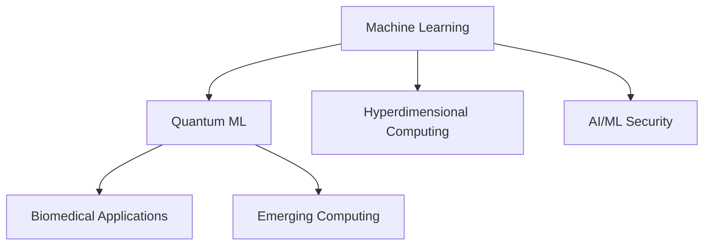

<h1 align="center">
  👋 Hi!!! I'm <span style="color:#0077B5">Abu Kaisar Mohammad Masum</span>  
</h1>

<p align="center">
  🚀 Ph.D. Student | Quantum Machine Learning, Hyperdimensional Computing | Researcher with 750+ Citations
</p>

<p align="center">
  ⭐️ Check out my work on 
  <a href="https://scholar.google.com/citations?user=B194MGYAAAAJ" target="_blank">
    <strong>Google Scholar</strong></a>
</p>

---

## 👨‍💻 About Me:

🎓 **Ph.D. Student** in Quantum Machine Learning @ University of Louisiana at Lafayette  
📘 Former B.Sc. in CSE @ Daffodil International University, Bangladesh  
📊 **Published in**: DAC, ISLPED, ISCAS, HPCA, GLSVLSI, QCE, MWSCAS  
🌐 **750+ Citations** | 🏆 DAC Young Fellow 2025 | 📍 Poster @ IEEE VIS 2024  

🧠 Awards & Grants:
- 🏅 DAC Young Fellow 2025
- 🎓 Academic Excellence & Leaf Award (ULL)
- 🌟 Outstanding Student & Peer Tutoring Excellence (FIT)
- ✈️ IEEE CEDA Travel Grant, Quantum Ideas Summer School (Duke), TigerAI Bootcamp

🔗 I’m affiliated with IEEE, IEEE CASS, CEDA, Quantum TC  
🗣 Delivered invited talks e.g., Ingenii Global Meetup 2023  
📜 Certified: IBM Quantum Challenge 2024, AWS Data Engineering, AI & ML Security Bootcamp

---

## 🔍 Currently Working On:
[**Machine Learning, Quantum ML, HDC, Biomedical AI**](https://www.linkedin.com/in/abukaisar24/)

---

## 📫 Reach Me At:

- 📧 Email: [abukaisar24@gmail.com](mailto:abukaisar24@gmail.com)
- 💼 [LinkedIn](https://www.linkedin.com/in/abukaisar24/)
- 🌐 [My Website](https://sites.google.com/view/abu-kaisar-mohammad-masum)
- 👨‍🏫 [Faculty Page](https://faculty.daffodilvarsity.edu.bd/profile/cse/abukaisar.html)

---

## 🌟 Fun Fact:
```tsx
print("I love to search for beauty in the brain, not in outlook!!!")
```

🎂 *Serious only for work!! But not life!!!*

---

## 🚀 Tech Stack & Tools:

<p align="center">
  
</p>

---

## 📈 GitHub Insights:

<div align="center">
  
</div>

<div align="center">
  
</div>

<div align="center">
  
</div>

<div align="center">
  
</div>

---

## 🧠 Research Interests Visualized

> Here's a dynamic view of the areas I explore, from classical ML to cutting-edge quantum computing!


---

## 🎤 Talk & Certifications Showcase:

- 📢 *Ingenii Global Meetup 2023* — Invited Speaker  
- 🎓 *IBM Quantum Challenge 2024*  
- 🧠 *AI & ML Security Bootcamp* @ LSU/IBM  
- ☁️ *AWS Academy Data Engineering*  
- 🧪 *Quantum Ideas Summer School* @ Duke (Fully Funded)

---

## ❤️ Let’s Connect!

<p align="center">
  <a href="https://www.linkedin.com/in/abukaisar24/">
    
  </a>
  <a href="mailto:abukaisar24@gmail.com">
    
  </a>
</p>

---

### ✨ _“Striving to build beautiful minds, not just beautiful machines.”_
